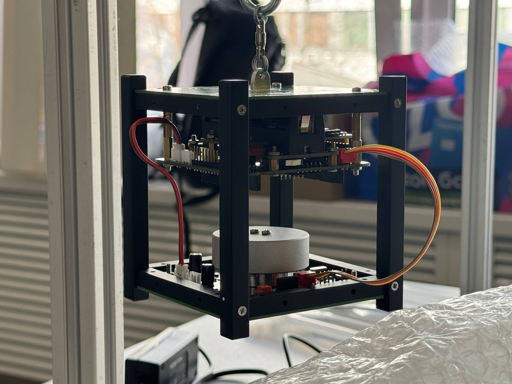

# NTO-Finals-2026

XI тур Национальной Технологической Олимпиады по профилю «Спутниковые Системы».
 
(Полу)-рабочее решение от команды C1cDez'а.

---

Технические детали спутника:

* Микроконтроллер - Blue Pill ( STM32F103C8T6 )
* Материнская плата - <i>(сдохла)</i>
* Гироскоп и Акселерометр - MPU 6050
* Магнитометр (конченый) - TLV493D-A1B6

---

Использовалась API: [IntroSatLib](https://github.com/Obu-IntroSat/IntroSatLib)

